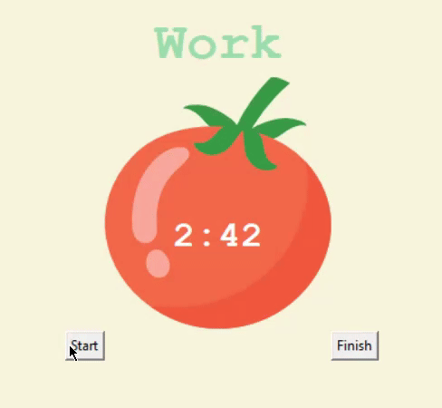

# 🍅 Pomodoro Timer (Tkinter Edition)

A clean and minimal **Pomodoro desktop timer** built using Python + Tkinter.
Designed to help maintain focus using structured work–break cycles while keeping the UI simple and distraction-free.

---

## ✨ Features

* ⏱️ Work, short break, and long break cycles
* 🔁 Automatic session switching
* ✅ Visual checkmarks after each completed work session
* 🛑 Reset button to restart timer anytime
* 🎨 Canvas-based UI with tomato graphic
* 🧠 Implements full Pomodoro logic

---

## 🛠️ Tech Stack

* **Python**
* **Tkinter (GUI)**

---

## 🧩 Pomodoro Flow

```
Work → Short Break → Work → Short Break → Work → Short Break → Work → Long Break → repeat
```

* After every work session → ✔ added
* After 4 work sessions → long break
* Reset clears everything

---

## ⚙️ Config (Editable)

Change timer durations from constants:

```python
WORK_MIN = 25
SHORT_BREAK_MIN = 5
LONG_BREAK_MIN = 20
```

For testing, you can keep them small.

---

## 🎥 Demo


**App Flow:**
```
start → countdown → break → ✔✔✔ → long break → reset
```
---

## 📘 Concepts Practiced

* Tkinter canvas + widgets
* `window.after()` timer scheduling
* State management with globals
* Event-driven GUI logic
* Time formatting (mm:ss)

---


## 👨‍💻 Author


- Manglam
- B.Tech (Computer Science)
- **GitHub:** https://github.com/Manglam11
- **GitHub:** https://github.com/Manglam11
